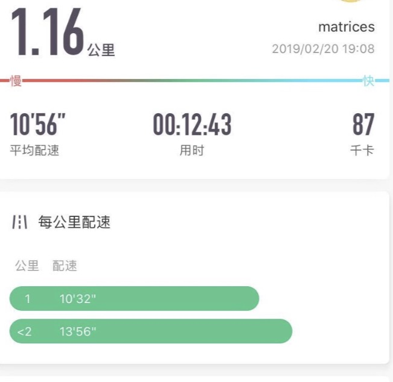
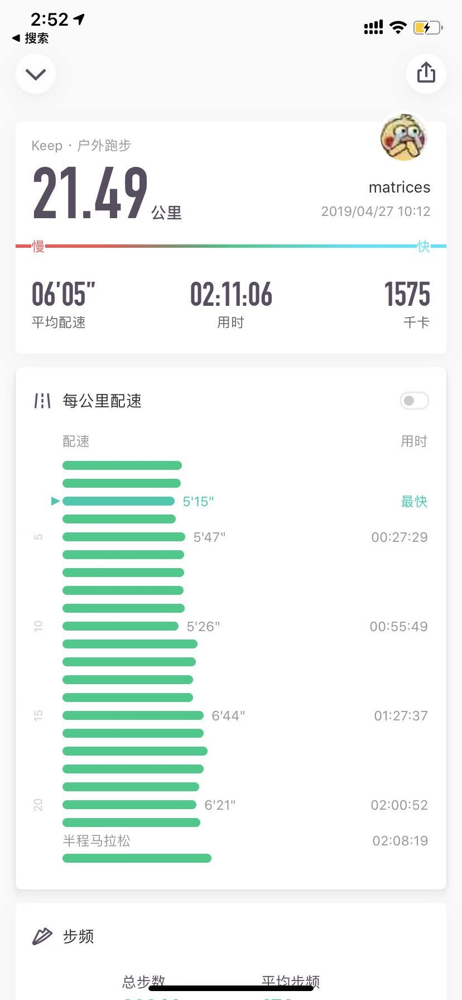

title: 2019年终总结
date: 2020-01-01 01:26:37
tags:
  - 日记
  - 年终总结
---

#### 好快喔一年又过去了  
  新工作的进度条已经跑过了一年，19年不管是学习还是工作生活，都比以往的几年有了很大的改变，我从一个死宅，10分钟跑完一公里，变到能够参加2场完赛的半程马拉松，在工作中也接触到了更多更多的开发者，以及更多有意思的需求，2019年从0到1，学习react-native & flutter 移动端的跨端技术，并且参与了跨端sdk的贡献，也开始接触了Webassembly，做了一个h264的软解码器原型，开启了未知领域的大门，也算是对现代客户端开发的近距离触摸。从半吊子的ruby后端，转做了全职的IM切图仔。还有就是增脂了。  

#### 做生活的甲方？  
  某个脱口秀节目组曾有过一个响亮的话题：“做生活的甲方”。那到底要怎么做才算甲方？以前也在知乎，微博见过这样的字眼，然而我对甲方和乙方真的没有什么认知，直到了我成为了一个全职的“乙方”，才清楚的明白甲方是个怎样的角色，甲方和乙方在签订契约以后，甲方看重的更多是自己的荣耀和乙方能给它带来价值，乙方则会尽量按照契约去实现对甲方的许诺。本质上是一个可信赖的纽带关系。为什么脱口秀节目要说“做生活的甲方”？也许这就是当下的“三和dai神”的内心独白，做一天，玩三天，黑厂不去，吃饭只吃挂逼面，只去5块钱包夜的网吧，不去5块一小时的网咖，谁不希望呢？当生活的甲方，那么谁是我的乙方？难道花呗，借呗，微粒贷就可以是我的乙方？那生活真的是太棒了。对于我这种普通人来说，生活最大的敌人只有堕落，工作和生活平衡对我来说才是这个问题的最合解。自然如何平衡也是一个选择题，我可以选择做乙方，但也可以在乙方角色里适当的切换，找到一个生活的音节，把它串来成为自己的节奏，为自己打拍，持续的生存下去。甲方很容易让我变得桀骜不驯，做出不正确的判断还活在自己的世界里，最后沦落5块钱包夜的网吧都进不去。当乙方的时候，我才会去反思自己以前的做事和处事是不是不够职业化，显得不够专业，不得以信赖，虽然这些是由个人因素造成的，但并不表明这是没法通过后天的训练和努力去改善。  

#### 开始跑马了  
  初遇大佬，我又又遇到了一个学医转行做程序员的大佬，在大佬的指导下我成功的从一名2019年年初10分钟跑完一公里的废宅，在几个月的努力下，完成了2场半程马拉松。第一次半程的经历实在是让我难以忘记，由于是第一次比赛，穿的不是训练鞋，加上个人比较兴奋，我在两公里的时候就已经跑崩了，心想大概是凉了，毕竟第一次嘛，也许我就不适合参加马拉松吧。但当我看到了一个和我一样情况的跑友，他并没有直接就放弃比赛，仅仅是降慢了速度，而且他的体型应该是我的1.5倍，没过一会儿人家就恢复了体力，直接远超了我，当时我十分的差异，因为这个跑步姿势和体型，不太像是一个专业的运动员，普通人也能有这样的恢复能力吗？突然回忆起大佬跟我说的话，开始不要跑太快，也不要和别人抢先后，请找到自己的节奏，并且坚持下去，完赛才是最终目标。果真奏效了，虽然没跑到个人最佳成绩，但是和我预想的差不多，2小时28分完赛，第一场比赛在六老师的故乡，刚好还是夏天，我和大佬在那边享用了一顿特别完美的皮皮虾大餐，也是人生中第一次吃到带黄的皮皮虾，而且黄特别足，味道一百分！这次的经历，让我更加相信，我是可以在大佬的帮助下，把自己往更好的方向改变。
    
#### 我的跑步战绩
    
    
    

#### 读完的书
  * 菊与刀（这本也是同事的力推下读完了，因为个人对日本社会比较好奇，抱着学习的心态，但是作者的个人观点太多，以及作者并不是一个日本人，最终让我对这本书的评价很低）
  * 精准努力（作者是一位金融从业者，表达了一个正常的企业是怎么决策和衡量价值的，有那种典型的日企思想，努力工作和精准努力工作，是两个不同的结果，尤其是在日企里。）
  * 半小时漫画中国史（快餐读物，由于个人一开始对历史没有任何兴趣，加上生活节奏很快，个人时间分配不合理，导致我没办法细致的读完《中国通史》，只能先快餐文化开始，总体来说画风和语言都比较适合我。）
  * 半小时漫画世界史（阅读体验同上）

#### 这一年我主要参与维护的开源项目  

##### 声网的场景化IM  
  * [https://github.com/agoraio-usecase/eEducation](https://github.com/agoraio-usecase/eEducation)

##### 声网的跨端SDK   
  * [https://github.com/syanbo/react-native-agora](https://github.com/syanbo/react-native-agora)
  * [http://github.com/agoraio/agora-react-native-rtm](http://github.com/agoraio/agora-react-native-rtm)
  * [https://github.com/agoraio/flutter-sdk](https://github.com/agoraio/flutter-sdk)
  * [https://github.com/agoraio/flutter-rtm](https://github.com/agoraio/flutter-rtm)

#### 2020年？
  想了解这个世界的灵魂传承：历史文化，时代变迁，神秘科技。   
  希望可以跑玩2020年完华东地区的所有马拉松。  
  要学好英语，过雅思7！再学一门外语。  
  好好学习现代前端技术。要有个属于自己的长期维护的开源项目。要坚持写博客！    
  希望生活和压力可以和解。  
  加油！